## Hi there 👋

<!--

**Here are some ideas to get you started:**

🙋‍♀️ A short introduction - what is your organization all about?
🌈 Contribution guidelines - how can the community get involved?
👩‍💻 Useful resources - where can the community find your docs? Is there anything else the community should know?
🍿 Fun facts - what does your team eat for breakfast?
🧙 Remember, you can do mighty things with the power of [Markdown](https://docs.github.com/github/writing-on-github/getting-started-with-writing-and-formatting-on-github/basic-writing-and-formatting-syntax)
-->

## 목차 
- [Hi there 👋](#hi-there-)
- [목차](#목차)
- [프로젝트 주제 :star:](#프로젝트-주제-star)
- [프로젝트 기간](#프로젝트-기간)
- [개발 환경](#개발-환경)
  - [하드웨어 리스트](#하드웨어-리스트)
  - [개발 스택](#개발-스택)
- [설계도 및 구성도](#설계도-및-구성도)
  - [Flow Chart](#flow-chart)
  - [하드웨어 설계도](#하드웨어-설계도)
  - [회로도](#회로도)
- [Flow Chart](#flow-chart-1)
  - [Close loop에서 PID 제어](#close-loop에서-pid-제어)
- [코드 설명](#코드-설명)
  - [Library 설명](#library-설명)
    - [1. AppScheduler](#1-appscheduler)
      - [Driver\_Stm](#driver_stm)
      - [App\_Scheduling](#app_scheduling)
      - [ERU\_Interrupt](#eru_interrupt)
    - [2. Drivers](#2-drivers)
      - [GPT12](#gpt12)
      - [ASCLIN](#asclin)
    - [3. IO](#3-io)
      - [Bluetooth](#bluetooth)
      - [Buzzer](#buzzer)
      - [Motor](#motor)
      - [TOF sensor](#tof-sensor)
      - [Ultrasonic](#ultrasonic)
- [추가 설명](#추가-설명)
    - [기본 모듈 설정](#기본-모듈-설정)
    - [전달함수 추정 검증 및 Gain tuning](#전달함수-추정-검증-및-gain-tuning)
    - [통합 라이브러리 코드 설명](#통합-라이브러리-코드-설명)

## 프로젝트 주제 :star:

- PID 제어를 통해 환경 변화에 관계 없이 목표 속도를 유지하는 자율 주행 기능

## 프로젝트 기간

- 2023년 11월 23일 ~ 2023년 11월 27일

## 개발 환경

### 하드웨어 리스트

|부품|사진|
|------|---|
|Aurix TC275 보드|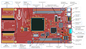|
|Easy Module Shield V1|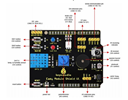|
|Arduino Motor Shield|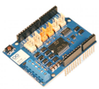|
|ToF 센서|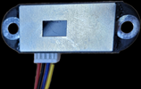|
|엔코더 DC 모터|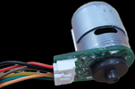|

### 개발 스택

- 개발 도구

||사진|
|------|---|
|MATLAB Simulink||
|AURIX Development||

- 협업 툴

||사진|
|------|---|
|Github| |
|Notion| |

## 설계도 및 구성도

### Flow Chart

### 하드웨어 설계도 

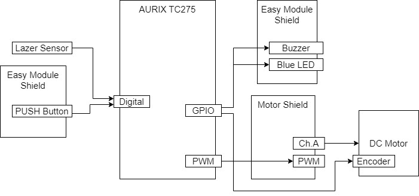

### 회로도
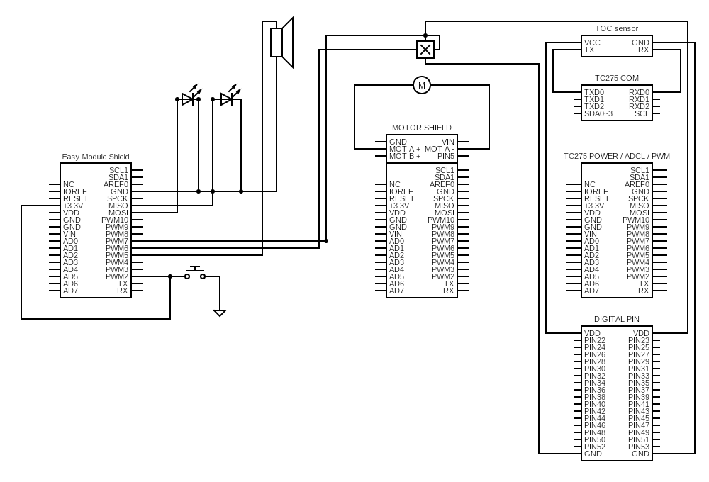

## Flow Chart

### Close loop에서 PID 제어
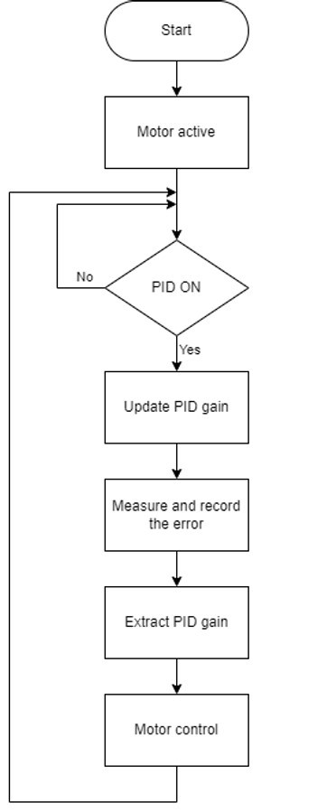

- PID gain을 업데이트 하고 엔코더를 통해 실제 측정값과 에러값을 추출, 피드백.

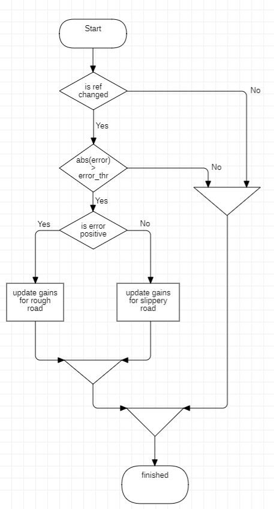
- 목표 속도에 대한 PWM 값을 설정, 모터 구동 

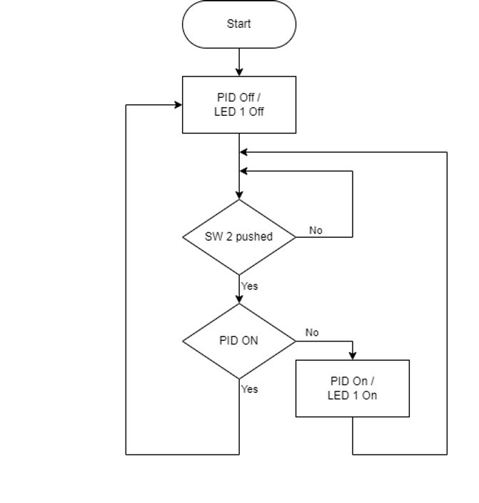

- Switch를 통해 Open loop에서 Closed loop으로 전환
- Closed loop : PID activate
- Open loop : PID dactivate

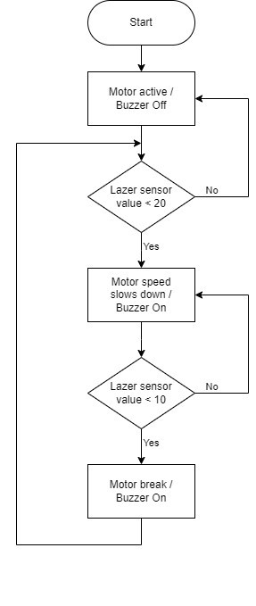

- 레이저 센서에 의해 전방 20cm 이내에 장애물이 감지될 경우, 모터의 속도 50% 감소
- 레이저 센서에 의해 전방 20cm 이내에 장애물이 감지될 경우, 부저가 0.5초 간격 작동.
- 레이저 센서에 의해 전방 10cm 이내에 장애물이 감지될 경우, AEB가 작동하여 모터 정지.

## 코드 설명

### Library 설명

#### 1. AppScheduler

##### Driver_Stm

##### App_Scheduling

##### ERU_Interrupt

#### 2. Drivers

##### GPT12

##### ASCLIN

#### 3. IO

##### Bluetooth

##### Buzzer

##### Motor

##### TOF sensor

##### Ultrasonic

## 추가 설명

추가적인 설명을 위해서는 다음의 URL을 참고하시기 바랍니다.

#### [기본 모듈 설정](https://github.com/HAMES-4P/Module_Dev/blob/main/README.md)

#### [전달함수 추정 검증 및 Gain tuning](https://github.com/HAMES-4P/Module_Dev/blob/main/Yunseo_Project_2_4/Readme.md)
#### [통합 라이브러리 코드 설명](https://github.com/HAMES-4P/Module-integration/blob/main/README.md)

